# GDAL Installation

GDAL can be installed and run on Windows, OSX and Linux and there are different approaches based on your operating system. There is a list [here](https://gdal.org/download.html) that give a good list of options. 

##Windows Installation

In the GDAL docs it recommends to use Conda to instal GDAL however one of the alternatives that is not listed is [GIS Internals](https://www.gisinternals.com/) which provide a number of options including MSI installers for Windows for both the stable and development release.

For this workshop we will use stable version and this can be download using the following instructions

1. Go to the releases [page](https://www.gisinternals.com/release.php) and choose the appropriate version (x64 or win32) for your Windows operating system.

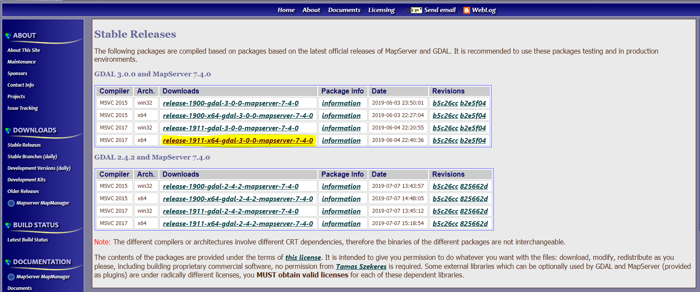

I have picked the MSVC 2017 x64 option highlighted in yellow

2. On the next page you will see a list of download options and we want to download the core MSI file. (We will ignore all the other download options for the time being)

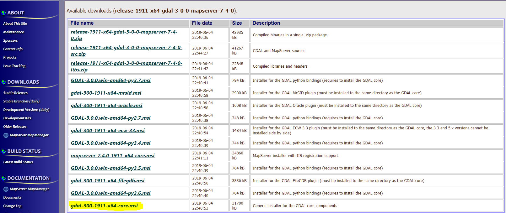

Once download, run the installer.

3. The installer wizard is pretty straight forward, just read and accept the licence terms, and then either choose 'Typical' or 'Complete' during the install process. (I personally do 'Complete')

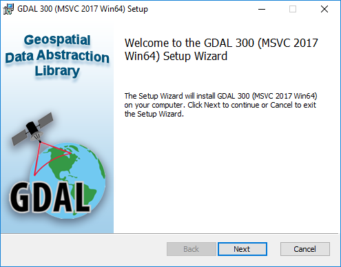

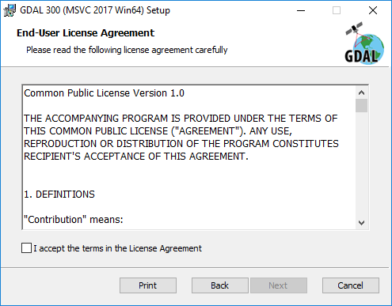

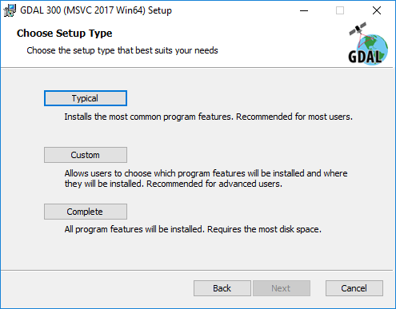

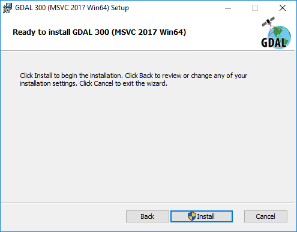

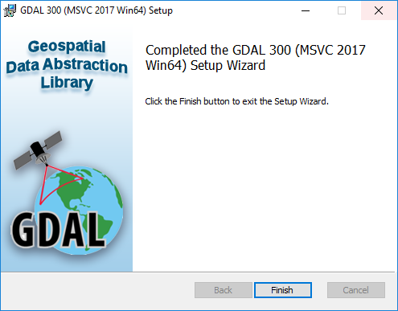

We know need to add some of the installation directories to the PATH environment variable so that everything is avaliable for us ot use as simply as possible.

__THIS NEXT SECTION INVOLVES EDITING SYSTEM VARIABLES, PLEASE CHECK THAT YOU ARE ALLOWED TO BY YOUR IT TEAM__


4. Open the System Properties and click 'Environment Variables'

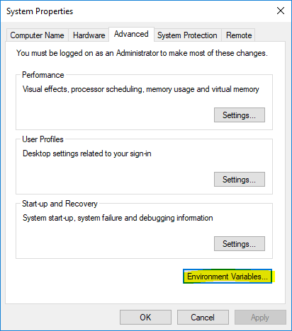

5. The new dialogue is split into two parts. User variables for the current user (the one logged in) and then in the bottom half 'System variables'. We need to add two new system variables and then edit the PATH variable.
   
6. Click New and a new dialogue box opens

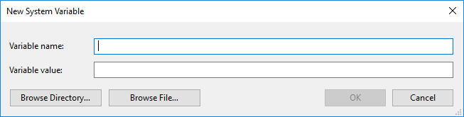

In Windows 10 there is now simpler approach to adding the path by using the Browse Directory.. button, use this to go to

```C:\Program Files\GDAL\gdal-data```

And give the variable a name of

```GDAL_DATA```

7. Repeat the above step to add a system variable called 'PROJ_LIB' with the variable value as 

```C:\Program Files\GDAL\projlib```

8. Next we need to add to the PATH environement variable so select it in the list of System variables (in the bottom half of the dialogue), and click 'Edit'

If you are on Windows 10 click 'New' and then use the 'Browse..' button on the right to go to 

```C:\Program Files\GDAL```

If you are on Windows 7 and before it is likely that the PATH environement variable is a semi colon seperated list so append the append the folder path to the end.

```;C:\Program Files\GDAL```

Hit OK on the open dialogue windows and we can now check that GDAL is installed and accessible from the command line.


9.  Check the installation. Open a Powershell/Command Prompts window and run the following

```gdalinfo --version```

This should display 

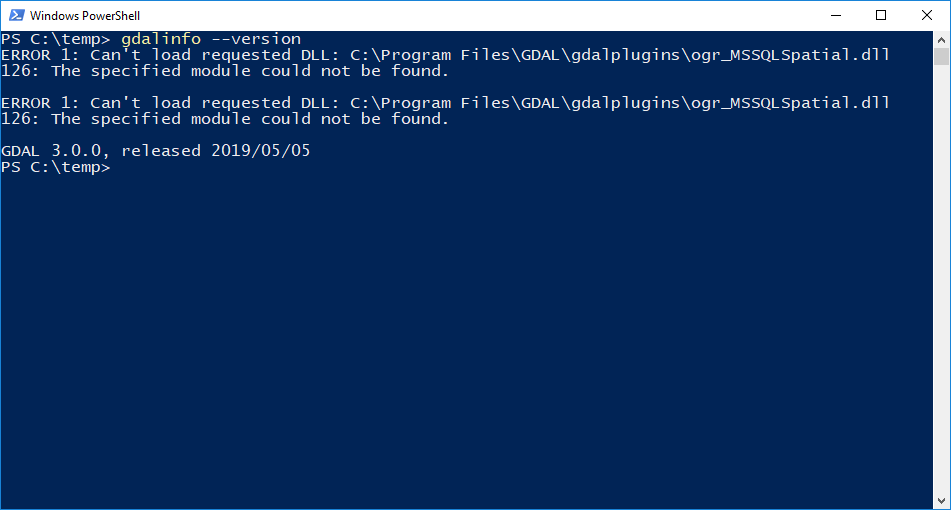

Ignore the MSSQLSpatial error - this is due because the SQL Server Native Client is not installed on the system.

You can see the GDAL version is 3.0.0 released 2019/05/05 (this might be different depending on when you use this workshop)

If you get an error like this

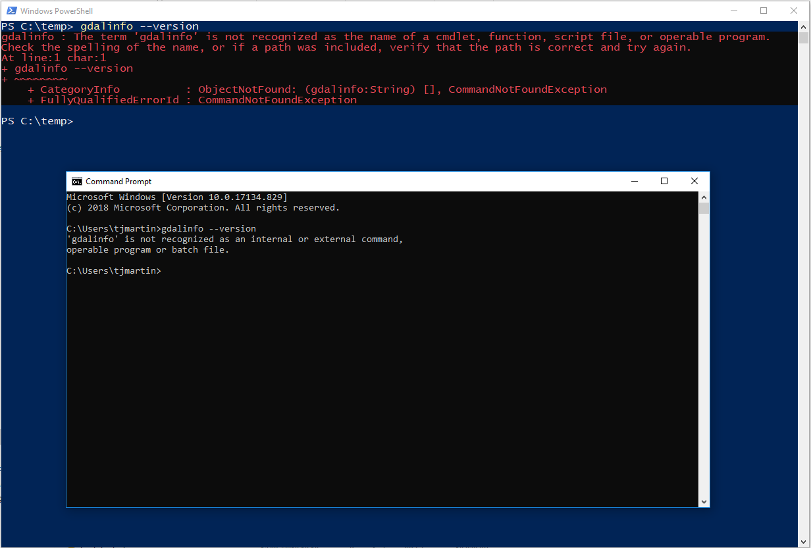

This is likely because the environment variables we not set correctly. Retry some of the above steps and try again.

__After editing environment variables you must close and reopen any open termianls, command prompt or powershell windows so that they can pick up the updated variables__


