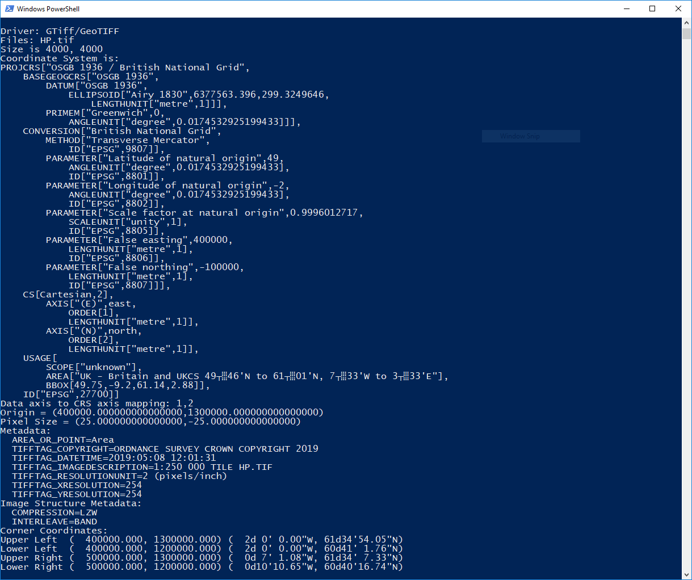
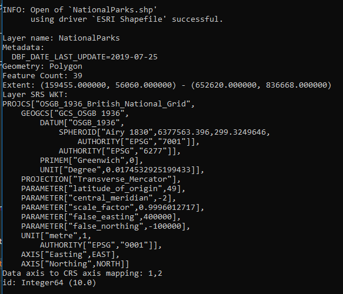

# 2. Getting Started
---
This workshop section will introduce some of the main GDAL utilities that you will use in the rest of the workshop. Make sure you have a working GDAL by running

```gdalinfo --version```

From the command line (terminal, PowerShell or command prompt) and making sure it shows the version you expect.

A list of Utilities/Programs is found [here](https://gdal.org/programs/index.html) and they all have a different purpose and listed below are the most common.

1. __ogr2ogr__ - for Vector spatial data this is the program that you will use to convert from one format to another, or changes it projection or query it directly using SQL
2. __gdal_translate__ - this is the equivalent of ogr2ogr for Raster data. You can use this to do conversions from GeoTiff to ECW, change the compression or colour palette.
3. __gdalwarp__ - this is used to change the projection of a Raster file, for example from British National Grid to Web Mercator
4. __gdalbuiltvrt__ - this program builds a Virtual Dataset of many files of the same type, think image catalogue for many imagery files.
5. __gdaladdo__ - this adds internal or external overviews to Raster files which makes viewing these significantly faster at different scales to their native resolution

All of the above programs use and expect different inputs/outputs and parameters and so we will investigate each of them in the other sections.

In this section we get use to using the command line and try out the program 

__gdalinfo/ogrinfo__ - both of these are useful for finding out the metadata of the file. It will give you the format, number of features, projection, bounding box etc

Open a terminal/PowerShell/command prompt window in the data directory of the workshop and run the following command

```gdalinfo --formats```

This will return a list of all the raster spatial formats that are supported in this version of GDAL


In the list you will see the shorthand name of the supported formats and whether it can read or write that format and then the full format name. It is important to know the shorthand name as this is option used. For example GTiff is GeoTiff.

## 2.1 GDALINFO
---
Now lets use gdalinfo on one of our files to find out the metadata on the file.

Open the command prompt window in the Data/Raster/Raster_250k folder where there are a number of Ordnance Survey Raster 1:250 000 Scale Colour Raster. 

We will use __gdalinfo__ to find out more about one of these tiles, so lets run

```gdalinfo HP.tif```

And we should get an output like this



The output gives us a lot of information about this file including its coordinate system (if it has one), the pixel size, origin, metadata, the compression used on the file and the colour ramp.

In the [docs](https://gdal.org/programs/gdalinfo.html) it lists a number of different parameters that can be used with the gdalinfo command to return different information than the default output. So lets try a few out

1. JSON Output

```gdalinfo -json HP.tif``` 

This outputs a JSON object which can often be easier to parse

You will see that the colour table is incredible long and might not be information that we need, so lets hide that

2. Hide colour table

```gdalinfo -json -noct HP.tif```

Which returns a much smaller output.

3. Show the proj4 string of the coordinate system

```gdalinfo -json -noct -proj4 HP.tif```

Which has added the following proj4 definition string to our output

"proj4":"+proj=tmerc +lat_0=49 +lon_0=-2 +k=0.9996012717 +x_0=400000 +y_0=-100000 +ellps=airy +units=m +no_defs"


## 2.2 OGRINFO
---
We can use similar commands on Vector datasets using __ogrinfo__. However it does have a different list of parameters so it is worth looking at the [docs](https://gdal.org/programs/ogrinfo.html#ogrinfo)

so open a new command prompt window in Data/Vector/Shapefile.

1. Default output

```ogrinfo NationalParks.shp```

2. Summary Output

```ogrinfo -so NationalParks.shp```

You will notice that it really doesn't give us too much info except the name of the file being opened and what driver is being used to open it. You might think 'I was expecting more...'

Well what ogrinfo is displaying is the layername within the ESRI Shapefile so lets expand on the previous command and provide the layer name as well.

```ogrinfo -so NationalParks.shp NationalParks```



You can now see that GDAL gives us lots of really useful information about our file. Type of geometry, feature count, extent, projection and attributes.

If you want to see all the feature information you can run the following command

```ogrinfo -al NationalParks.shp```

You will see the print out of all the coordinates. So best to avoid this on a massive file.

You can get specific information about a single feature using the __-where__ parameter, so for example

```ogrinfo -so -where id=1 NationalParks.shp NationalParks```

And if you wanted the full information on that feature you would switch from the __-so__ to the __-al__ parameter.

In recent versions of GDAL **ogrinfo** can now be used with the -json switch so that the output is also in a JSON format, much like **gdalinfo**. 