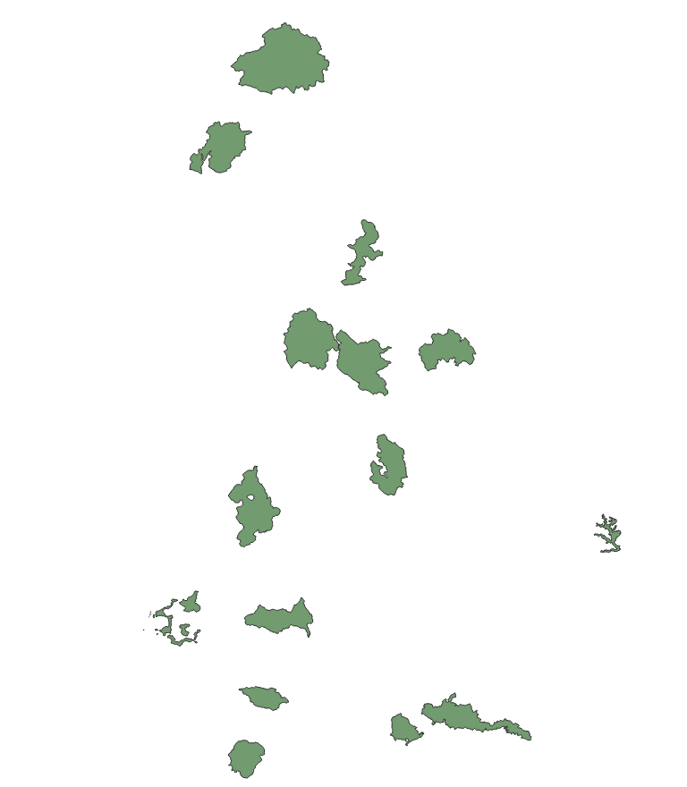
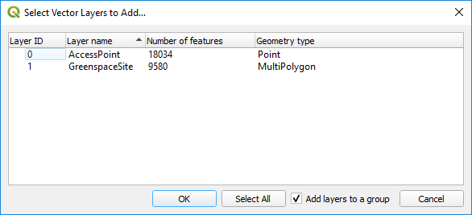

# 3. Vector Data
---
This chapter concentrates on using GDAL/OGR to convert, process and manipulate various different vector datasets. The most command line tool used for this is [ogr2ogr](https://gdal.org/programs/ogr2ogr.html#ogr2ogr). By using the variety of parameters listed in the documentation OGR2OGR can be used to do __anything__ with vector data. 

From the docs ogr2ogr is described as

> ogr2ogr can be used to convert simple features data between file formats. It can also perform various operations during the process, such as spatial or attribute selection, reducing the set of attributes, setting the output coordinate system or even reprojecting the features during translation.

So let's crack on and give it a try.

## 3.1 Basic Translation
---
We will start with a very basic command that translate from one spatial format to another, in this case ESRI Shapefile to GeoPackage (my favourite format at the moment).

Open a command prompt in the Data/Vector folder and run..

```ogr2ogr -f GPKG ../../Results/NationalParks.gpkg NationalParks.shp```
  
GDAL will run and create our new GeoPackage, open this file in QGIS.



And we should see the National Parks.

Not very exciting translation but it introduces several key principles.

- We are invoking ogr2ogr (which is found in our PATH so do not need to give the full path to the exe file)
- We set the output file format using -f
- Output filename
- Input filname

## 3.2 Seeing progress and speeding up
---
We can now use a few extra parameters to improve and tweak things

```ogr2ogr -progress -gt 50000 -f GPKG ../../Results/NationalParks_2.gpkg NationalParks.shp```

We have used two new parameters

- __-progress__ which outputs the progress counter. Very useful for when translating big files and you want to keep track 
- __-gt__ for database output formats like GeoPackage and PostGIS we can set the gt number which groups that number of features together into a single transaction. Changing this number with such a small feature set found in NationalParks won't make much a difference but try this out on a bigger file and you will see massive uplifts in performance.


## 3.3 Setting and using Projection Transformations
---
Sometimes we can translate a file and it might not have a spatial reference file (eg for ESRI Shapefile a .proj file) and therefore applications like QGIS have no idea where this dataset lives. So on opening the file you might see the prompt to ask you


Within ogr2ogr there are three parameters we can use to set the coordinate reference system or even translate from one CRS to another.

- __-a_srs__ is used to __ASSSIGN__ (hence the a) a CRS with the file.
- __-s_srs__ is used to set the __SOURCE__ (hence the s) CRS of the file
- __-t_srs__ is used to set the __TARGET__ (hence the t) CRS to transform to

We can see this in action by converting our National Parks ESRI Shapefile to a different ESRI Shapefile in WGS84 (EPSG:4326) projection.

```ogr2ogr -progress -f "ESRI Shapefile" ../../Results/NationalParks_WGS84.shp NationalParks.shp -s_srs EPSG:27700 -t_srs EPSG:4326```

If you open the NationalParks_WGS84.prj file in a text editor you will see it shows.

> GEOGCS["GCS_WGS_1984",DATUM["D_WGS_1984",SPHEROID["WGS_1984",6378137.0,298.257223563]],PRIMEM["Greenwich",0.0],UNIT["Degree",0.0174532925199433]]

Whilst the original proj file contained

> PROJCS["OSGB_1936_British_National_Grid",GEOGCS["GCS_OSGB 1936",DATUM["D_OSGB_1936",SPHEROID["Airy_1830",6377563.396,299.3249646]],PRIMEM["Greenwich",0],UNIT["Degree",0.017453292519943295]],PROJECTION["Transverse_Mercator"],PARAMETER["latitude_of_origin",49],PARAMETER["central_meridian",-2],PARAMETER["scale_factor",0.9996012717],PARAMETER["false_easting",400000],PARAMETER["false_northing",-100000],UNIT["Meter",1]]

You can see that the new file has the CRS for WGS84 so the translation worked.

What else did you notice that was different in that ogr2ogr command?

We dropped the __-gt__ parameter because the ESRI Shapefile we are converting to is not a database format so cannot use transactions to speed it up.

## 3.4 Using additional projection files
---
In the in-built coordinate transformations are built on the Proj library. There is an excellent write up all about the Proj Library and its history [here](https://gaia-gis.it/fossil/libspatialite/wiki?name=PROJ.6). However, on the rare occasion the library does not contain the most accurate transformation for a particular CRS and that is the case for British National Grid.

Ordnance Survey release a transformation model called [OSTN15](https://ordnancesurvey.co.uk/business-and-government/help-and-support/navigation-technology/os-net/formats-for-developers.html) which improves the accuracy of coordinate transformation and we can use that in conjunction with GDAL to improve our conversion.

Download the NTv2 format files from the website and extract them to a suitable place on your computer.

The below command gives you and example of how to use the __OSTN15_NTv2_OSGBtoETRS.gsb__ which I extracted to C:\Proj4, if your location is different replace the path to where the gsb file is.

```ogr2ogr -progress -f "ESRI Shapefile" ../../Results/NationalParks_WGS84_OSTN15.shp NationalParks.shp -s_srs "+proj=tmerc +lat_0=49 +lon_0=-2 +k=0.999601 +x_0=400000 +y_0=-100000 +ellps=airy +units=m +no_defs +nadgrids=C:\Proj4\OSTN15_NTv2_OSGBtoETRS.gsb" -t_srs EPSG:4326 ``` 


As you can see there is a difference in coordinate accuracy and even though it might look small it could make a big difference depending on the use case.

So to explain the command we have used the __-s_srs__ parameter but this time defined the original Proj4 string for EPSG:27700 British National Grid and set the nadgrids to the local OSTN15 gsb file downloaded from the OS website.

## 3.5 Read zips/gzips and other virtual formats
---
GDAL can not only read from the wide number of formats listed when you run ```ogrinfo --formats``` it can also read what they call [Virtual File Systems](https://gdal.org/user/virtual_file_systems.html) which can be zip files (.zip), gzip files (.gz) and Network hosted files on places like Amazon S3 or Google Cloud and Azure Blobstore.

This can save us a lot of time and effort by not having to extract the files first.

We can initially check the file using the __ogrinfo__ as before.

```ogrinfo /vsizip/NationalParks.zip```

Again it will successfully read the file and list the different layers.

Even with zip files that contain multiple ESRI Shapefiles ogrinfo will list all the layers.

However, when we come to translate them using __ogr2ogr__ we need to declare the full path within the zip.

```ogr2ogr -f GPKG NationalParks.gpkg /vsizip/NationalParksPoints.zip -a_srs EPSG:27700```

Because our output format (GPKG) can support multiple tables our many-to-many works and the GPKG created will contain both a table of points and polygons.

However, when we got from a many-to-one format for example to an ESRI Shapefile the translation will create a folder filled with an ESRi Shapefile for each.


```ogr2ogr -f "ESRI Shapefile" NationalParks.shp /vsizip/NationalParksPoints.zip -a_srs EPSG:27700```

If you only want to translate one of the ESRI Shapefiles then you specify the full path to the file within the zipfile.

```ogr2ogr -f "ESRI Shapefile" Points.shp /vsizip/NationalParksPoints.zip/NationalParkPoints.shp -a_srs EPSG:27700```


We can use the same technique for reading data from Gzip files by using __/vsigzip/__ and remote sources. These are covered in other specific chapters.

## 3.6 Reading GML data
---
Because of working at Ordnance Survey where a large number of our data products are delivered in GML it is important to know how GDAL/OGR2OGR can work with it.

First it is best to use ogrinfo to parse the file and help us understand the data.

```ogrinfo OSOpenGreenspace_SU.gml```

__ogrinfo__ will successfully read the file and as before print the driver used and the data layers found within the file.

**HOWEVER** you may have noticed a new file has been created, __OSOpenGreenspace_SU.gfs__, from the documentation:

>The first time a GML file is opened, if the associated .xsd is absent or could not been parsed correctly, it is completely scanned in order to determine the set of featuretypes, the attributes associated with each and other dataset level information. This information is stored in a .gfs file with the same basename as the target gml file. Subsequent accesses to the same GML file will use the .gfs file to predefine dataset level information accelerating access. To a limited extent the .gfs file can be manually edited to alter how the GML file will be parsed. Be warned that the .gfs file will be ignored if the associated .gml file has a newer timestamp.

So essentially a GFS file is an alternative to an xsd file to help ogr parse the GML file correctly and as mentioned this can be edited, which we will do in a moment.

If you open the __OSOpenGreenspace_SU.gfs__ in a text editor you should see


You can that it is an XML document and it defines the layers, their geometry type and the features attributes and their types.

Let's translate the GML file to a GPKG.

```ogr2ogr -progress -gt 100000 -f GPKG OSOpenGreenspace_SU.gpkg OSOpenGreenspace_SU.gml -a_srs EPSG:27700```

The translation will create a GPKG that we can open in QGIS and you will see the following dialogue when we try to open it.



You can see __ogr2ogr__ has correctly parsed the GML file and create two GPKG tables (AccessPoint, GreenspaceSite).


As mentioned above if we modify the GFS we can control what ogr reads from the GML file.

For example if we only want it to parse the GreenspaceSite data and only a subset of the attributes we can modify the GFS to be:


We can then change our original __ogr2ogr__ command to

```ogr2ogr --config GML_GFS_TEMPLATE OSOpenGreenspace_Modified.gfs -progress -gt 100000 -f GPKG OSOpenGreenspace_Modified.gpkg OSOpenGreenspace_SU.gml -a_srs EPSG:27700```


You can see only the polygon GreenspaceSite features with just their function attribute have been parse from the GML.

This ability to modify the GFS file is extremely useful especially when ogr cannot automatically find all the relevant information from the GML file, which can be extremely complex.

---
# END OF VECTOR CHAPTER
---
