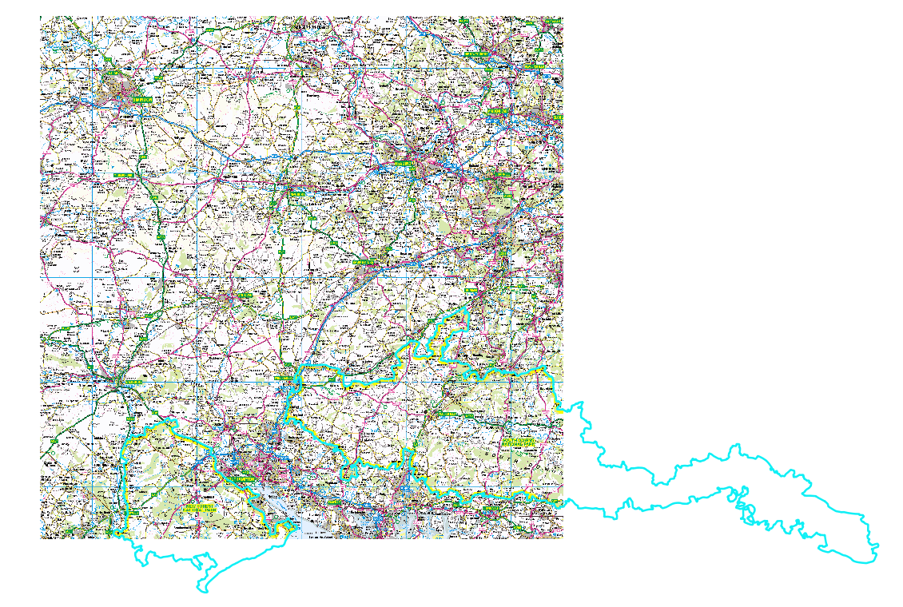
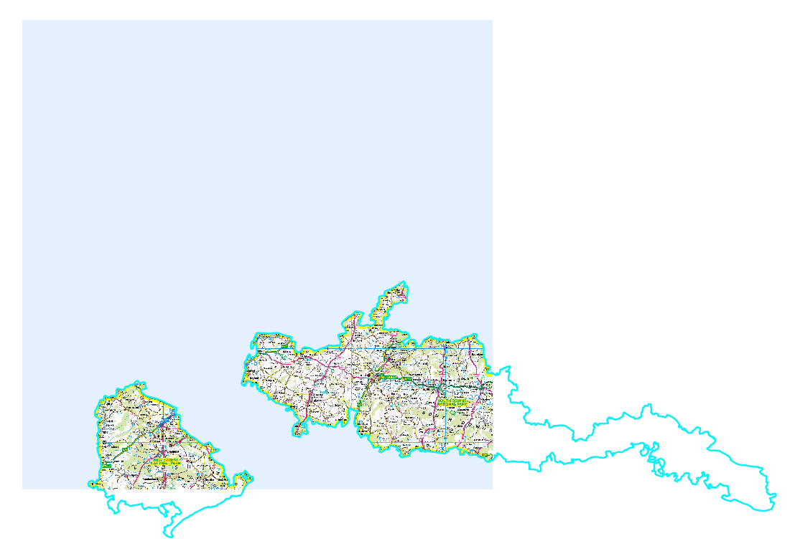
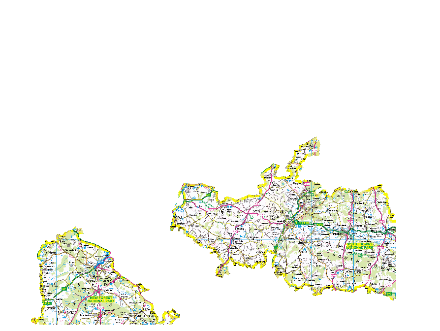
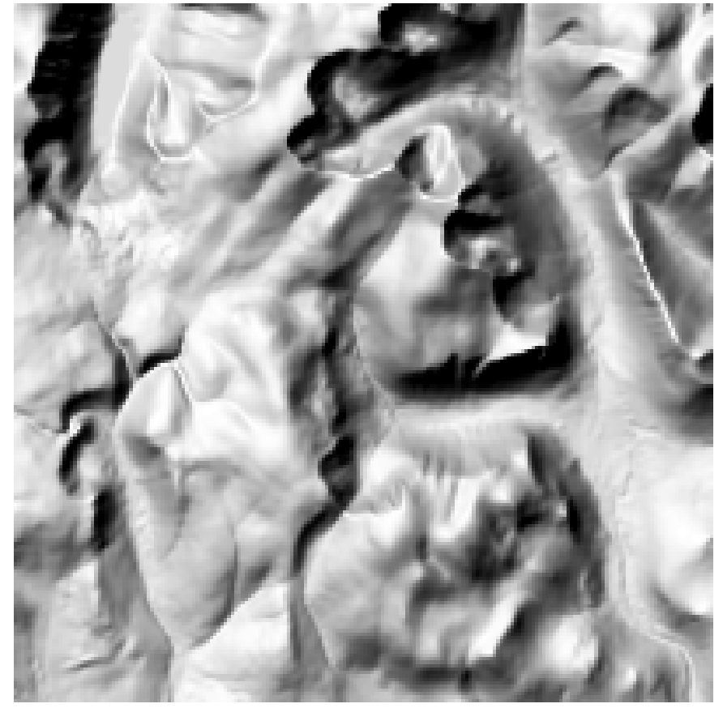

# 4. Raster Data
---
This chapter is focused on using GDAL to work with raster data. Much like translating and processing vector data GDAL comes with a number of different tools that can do a number of different types of procressing.

## 4.1 Create Virtual Rasters/Image Catologues/Image Mosaics
---
Often you might find that you have tens, hundreds, thousands of raster files and to process or even open each one would take a very long time. GDAL offers a great tool call [GDALBUILDVRT](https://gdal.org/programs/gdalbuildvrt.html) to build a virtual dataset and provide a single file to use.

Open a command prompt/terminal in the Data/Raster/Raster_250k folder and run the following

```gdalbuildvrt Raster_250k.vrt *.tif```

This should run successfully **HOWEVER** depending on where you installed GDAL from you might find that on Windows 10 that you receive an error message. There is an open issue on [github](https://github.com/OSGeo/gdal/issues/1749).

So one work around or another method to provide a list of files to gdalbuildvrt is to create the file list in a textfile and then provide that to gdalbuildvrt

In the command prompt run

```dir /b /s *.tif > filelist.txt```

Then run

```gdalbuildvrt -input_file_list filelist.txt Raster_250k.vrt```

You can now opne the single .vrt file in software like QGIS, ESRI etc.

But you can now use the vrt for other processing.

## 4.2 Convert to a single image and compression
---
What happens if you would prefer a single image than a VRT

```gdal_translate -f GTiff Raster_250k.vrt Raster_250k.tif -a_srs EPSG:27700```

If you run gdalinfo on this single image it will show some useful information similar to what was dicussed in the 'Getting Started' page. In the Metadata there is no compression and the image is 183Mb, so lets add some compression.

A popular compression to add is JPEG or LZW and this does depend on the data and does take some trial and error to make sure the results are as you expect as some compressions are LOSSY or LOSSLESS.

```gdal_translate -f GTiff Raster_250k.vrt Raster_250k_LZW.tif -co COMPRESS=LZW -a_srs EPSG:27700```

So the same output with very little noticable difference is 5.3Mb giving us a massive saving in disk space.

## 4.3 Adding Overviews for Performance
---
Some raster files can be huge, even Terabytes in size, and these files can be impossible to visualise in a desktop GIS. Even a national set of Raster 250k can be big enough to be slow to render at different zoom levels.

To combat this you can add __Overviews__ to the file to improve the performance. To add overviews to a raster file we use the tool [__gdaladdo__](https://gdal.org/programs/gdaladdo.html). Up until version 2.3 of GDAL you need to define the number of overview levels, this is no longer the case and you can let __gdaladdo__ to determine this for you.

```gdaladdo Raster_250k_LZW.tif```

This will increase our filesize by around 2Mb and you can check the overviews have been adding by running gdalinfo

```gdalinfo Raster_250k_LZW.tif```

In the output you will see

>Overviews: 8000x6000, 4000x3000, 2000x1500, 1000x750, 500x375, 250x188

So __gdaladdo__ has added 6 levels of overviews and if you open this in your GIS application you might notice a difference when you zoom in and out.

## 4.4 Cutting raster with vector   
---
You might sometimes needs to trim or cut a raster file using a vector file. You can do this using [GDAL Warp](https://gdal.org/programs/gdalwarp.html#gdalwarp)

Lets see the raster and vector together



Then run the following GDAL command in the Data/Raster_Vector folder where the SU.tif and NationalParks.shp exist.

```gdalwarp -of GTiff -cutline NationalParks.shp SU.tif SU_Cut.tif -s_srs EPSG:27700 -t_srs EPSG:27700 -co COMPRESS=LZW```



You can see that the raster has been clipped to our NationalParks.shp polygon. **HOWEVER** we have a weird output where we now have a blue area where data used to be. 

You can definitivley set this area to no data by running 

```gdalwarp -srcnodata 0 -dstnodata 0 -cutline NationalParks.shp SU.tif SU_DSTNODATA_9.tif -s_srs EPSG:27700 -t_srs EPSG:27700 -co COMPRESS=LZW```



## 4.5 Increasing GDAL performance
---
Sometimes some of the GDAL commands especially __gdalwarp__ can be a little slow and just like using COPY or using __-gt__ in ogr you can set two config options to speed GDAL up.

1. --config GDAL_CACHEMAX
2. -wo NUM_THREADS=val/ALL_CPUS
3. -multi

These will dramatically increase the speed of a translation.

For example in a command prompt you can run the following to time the command

```cmd /v:on /c "echo !TIME! & gdalwarp HT_JPEG.tif HT_JPEG_3857.tif -s_srs EPSG:27700 -t_srs EPSG:3857 -co COMPRESS=JPEG -co PHOTOMETRIC=YCBCR -co TILED=YES & echo !TIME!"```


```cmd /v:on /c "echo !TIME! & gdalwarp --config GDAL_CACHEMAX 2048 -wo NUM_THREADS=ALL_CPUS -multi HT_JPEG.tif HT_JPEG_3857_FAST.tif -s_srs EPSG:27700 -t_srs EPSG:3857 -co COMPRESS=JPEG -co PHOTOMETRIC=YCBCR -co TILED=YES & echo !TIME!"```

**HOWEVER** this is really dependent on the speed of other parts of the translation like the compression, adding tiles. In my own tests on an Imagery tile with no compression or tiles the conversion actually took 11 seconds longer using the extra config settings.

So it is definitely worth testing a few different permutations to find the correct one for your data.

## 4.6 Imagery
---
Paul Ramsey has a fantastic blog post all about the best compression and palette settings for Imagery files. I won't copy the details here but it can be found on his [Clever Elephant Blog](http://blog.cleverelephant.ca/2015/02/geotiff-compression-for-dummies.html)


## Generating Contours
---
One of the other programs within GDAL is __gdal_contour__ which can be used to generate 2D or 3D contour lines and even contour polygons from different types of elevation raster data.

Open a command prompt window in the Data/Grid folder and run the following

```gdal_contour -f GPKG NN99.asc Contours_2D.gpkg -i 10 -a elevation```

This will create a GeoPackage containing 2D Contour linestrings with an attribute (-a) called __elevation__ at an interval of 10 metres (-i 10).

__gdal_contour__ can also generate 3D linestrings by using the -3d parameter

```gdal_contour -f GPKG NN99.asc Contours_3D.gpkg -i 10 -a elevation -3d```

We can check this using ogrinfo (not gdalinfo because the GPKG is a vector format and not raster)

```ogrinfo Contours_3D.gpkg```

And it will tell us that it is a 3D Line String which can be used in various different 3D applications.

However some software cannot handle 3D lines so it can be useful to generate contour polygons

```gdal_contour -f GPKG NN99.asc Contours_Polygons.gpkg -i 10 -amin min -amax max -3d -p```

This will generate contour polygons and you may notice that you have had to define two new parameters -amin and -amax to declare the attribute name for the polygon's min and max elevations.

## Generating hillshade
---
One common technique to be used on an elevation raster is to create hillshades. This can be achieved using the __gdaldem__ program.

```gdaldem hillshade -co NUM_THREADS=ALL_CPUS --config GDAL_CACHE_MAX 2048 -co COMPRESS=LZW -z 3 -az 315 -alt 60 -of GTiff -compute_edges NN99.asc Hillshade.tif```

The parameters used above are useful settings for UK data as it uses the correct vertical exaggeration (-z), azimuth (-az) and altitude settings (-alt). The output of which can be seen below.



__gdaldem__ can used in the same way to generate

1. Hillshade
2. Slope
3. Color Relief
4. TRI
5. TPI
6. Roughness

outputs as well. You can experiment with these different modes using the same NN99.asc file.

---
# END OF RASTER CHAPTER
---