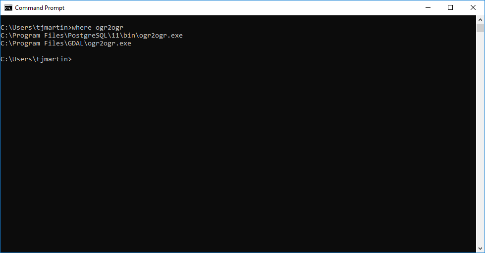

# Frequently Asked Questions (FAQs)

This page is to try and capture any questions or issues that are picked up and need resolving

## 1. EPSG error during reprojection 

>Unable to open EPSG support file gcs.csv.  Try setting the GDAL_DATA environment variable to point to the directory containing EPSG csv files.

If you have set the PROJ_LIB environment variable then this problem can be caused by also having PostgreSQL installed and having added the C:\Program Files\PostgreSQL\x\bin folder into the PATH environment variable.

Order matters in the PATH environment variable and as PostgreSQL comes with GDAL it could be that you are currently using that version. You can check this by running.

```where gdalinfo```

In the command prompt and it could print the following.



If that is the case then you need to make sure the path to C:\Program Files\GDAL is earlier or before the path to C:\Porgram Files\PostgreSQL\x\bin.

